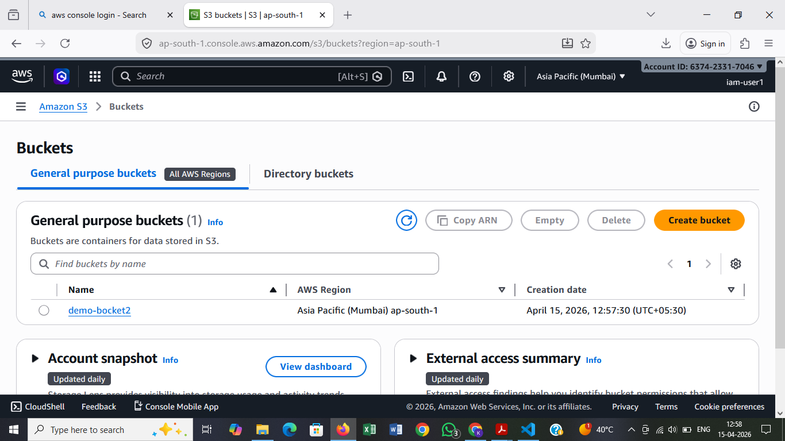
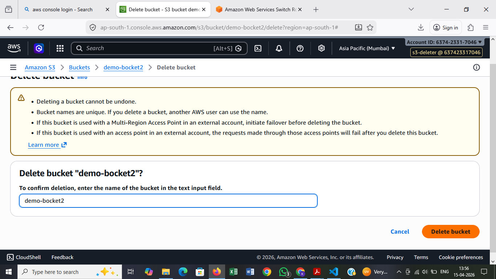
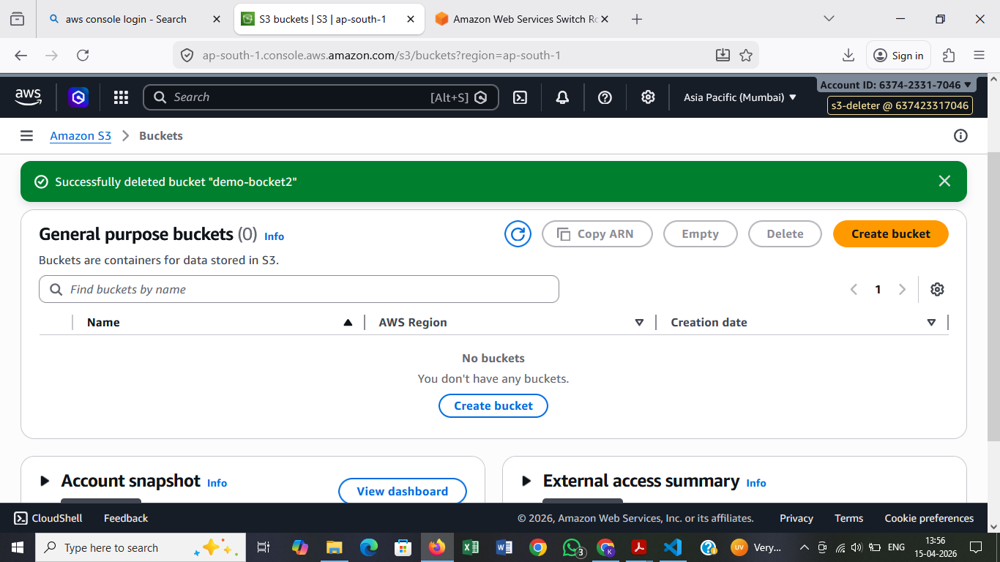

# AWS Day 2 — IAM (Least Privilege) with S3 (AWS Console)

This README documents the **same tasks using AWS Management Console** (no `awscli` commands), with a focus on **least-privilege** permissions.

## Prerequisites

- An AWS account with permissions to create IAM users/roles/policies (admin for lab is fine)
- Region picked for the lab (example: `ap-south-1`)
- A unique S3 bucket name (S3 bucket names are globally unique)

## Task 1 — Create an IAM User (least privilege) and create an S3 bucket

### Goal

- Create an IAM user
- Give only the permissions required to create **one** S3 bucket
- Sign in as that IAM user and create the bucket from the **S3 Console**

### Step 1: Create IAM User (Console access)

1. Go to **IAM → Users → Create user**
2. User name: `s3-user` (or any name)
3. Select **Provide user access to the AWS Management Console**
4. Choose **Autogenerated password** (or custom) and optionally require password reset
5. Create the user

### Step 2: Create a least-privilege policy for bucket creation

Decide your bucket name first (example: `my-day2-iamuser-bucket-12345`).

1. Go to **IAM → Policies → Create policy → JSON**
2. Paste and update `YOUR_BUCKET_NAME`:

```json
{
  "Version": "2012-10-17",
  "Statement": [
    {
      "Sid": "ListBucketsForConsole",
      "Effect": "Allow",
      "Action": [
        "s3:ListAllMyBuckets",
        "s3:GetBucketLocation"
      ],
      "Resource": "*"
    },
    {
      "Sid": "CreateBucket",
      "Effect": "Allow",
      "Action": "s3:CreateBucket",
      "Resource": "*"
    },
    {
      "Sid": "ConfigureThatBucketOnly",
      "Effect": "Allow",
      "Action": [
        "s3:PutBucketPublicAccessBlock",
        "s3:PutEncryptionConfiguration",
        "s3:PutBucketOwnershipControls",
        "s3:PutBucketTagging"
      ],
      "Resource": "arn:aws:s3:::YOUR_BUCKET_NAME"
    }
  ]
}
```

3. Name: `S3CreateOneBucketPolicy`
4. Create the policy

Note: The S3 Console may call additional APIs depending on which options you click. If you see **AccessDenied**, add only the missing action(s) shown by the error and keep the scope as narrow as possible.

### Step 3: Attach the policy to the IAM user

1. Go to **IAM → Users → s3-user → Add permissions**
2. Attach policy: `S3CreateOneBucketPolicy`

### Step 4: Sign in as the IAM user and create the bucket

1. Go to **IAM → Users → s3-user → Security credentials**
2. Copy the **Console sign-in URL**
3. Sign out of the admin user
4. Sign in using the IAM user credentials
5. Go to **S3 → Create bucket**
6. Create bucket name: `YOUR_BUCKET_NAME`
7. Keep default settings (recommended for lab) and create

### Validation

- Bucket creation succeeds when signed in as `s3-user`
- `s3-user` does not have delete permissions (unless added separately)

## Task 2 — Create an IAM Role (least privilege) and delete the above bucket using the role

### Goal

- Create a role that has only what is needed to **empty and delete one specific bucket**
- Assume (switch into) the role in the Console
- Delete the bucket using the role session

### Step 1: Create the IAM Role (for Console "Switch role")

1. Go to **IAM → Roles → Create role**
2. Trusted entity type: **AWS account**
3. Select **This account** (so you can use “Switch role”)
4. Continue without attaching permissions yet
5. Role name: `S3DeleteRole`
6. Create role

### Step 2: Create a least-privilege policy to delete that bucket

1. Go to **IAM → Policies → Create policy → JSON**
2. Replace `YOUR_BUCKET_NAME`:

```json
{
  "Version": "2012-10-17",
  "Statement": [
    {
      "Sid": "ListBucket",
      "Effect": "Allow",
      "Action": [
        "s3:ListBucket",
        "s3:ListBucketMultipartUploads"
      ],
      "Resource": "arn:aws:s3:::YOUR_BUCKET_NAME"
    },
    {
      "Sid": "DeleteObjects",
      "Effect": "Allow",
      "Action": [
        "s3:DeleteObject",
        "s3:AbortMultipartUpload",
        "s3:ListMultipartUploadParts"
      ],
      "Resource": "arn:aws:s3:::YOUR_BUCKET_NAME/*"
    },
    {
      "Sid": "DeleteBucket",
      "Effect": "Allow",
      "Action": "s3:DeleteBucket",
      "Resource": "arn:aws:s3:::YOUR_BUCKET_NAME"
    }
  ]
}
```

3. Name: `S3DeleteOneBucketPolicy`
4. Create the policy

If the bucket has **versioning enabled**, you will also need `s3:DeleteObjectVersion` permissions.

### Step 3: Attach the policy to the role

1. Go to **IAM → Roles → S3DeleteRole → Add permissions**
2. Attach policy: `S3DeleteOneBucketPolicy`

### Step 4: Assume the role and delete the bucket (Console)

1. Sign in as your admin user
2. In the top-right account menu, choose **Switch role**
3. Enter:
   - Account ID: your AWS account ID
   - Role name: `S3DeleteRole`
4. Switch role
5. Go to **S3 → Buckets → YOUR_BUCKET_NAME**
6. **Empty** the bucket
7. Delete the bucket

### Validation

- Bucket can be emptied and deleted while in the `S3DeleteRole` session

## Task 3 ⭐ — Test Trust Relationship: Role chaining with AssumeRole

### Goal

- Create **IAM-ROLE-1**: has **no S3 permissions**
- Create **IAM-ROLE-2**: has permission to create S3 bucket
- Configure trust so **ROLE-1 can assume ROLE-2**
- Use Console role switching to validate that bucket creation happens **only** via ROLE-2

### Step 1: Create IAM-ROLE-1 (no S3 permissions)

1. Go to **IAM → Roles → Create role**
2. Trusted entity type: **AWS account → This account** (so you can switch into it)
3. Role name: `IAM-ROLE-1`
4. Create role

Attach a permissions policy that only allows assuming ROLE-2:

```json
{
  "Version": "2012-10-17",
  "Statement": [
    {
      "Effect": "Allow",
      "Action": "sts:AssumeRole",
      "Resource": "arn:aws:iam::ACCOUNT_ID:role/IAM-ROLE-2"
    }
  ]
}
```

Replace `ACCOUNT_ID` with your account ID.

### Step 2: Create IAM-ROLE-2 (has S3 bucket create permissions)

1. Go to **IAM → Roles → Create role**
2. Trusted entity type: **AWS account** (we’ll edit trust policy after creation)
3. Role name: `IAM-ROLE-2`

Attach an S3 create-bucket permissions policy (same idea as Task 1, scope as needed):

```json
{
  "Version": "2012-10-17",
  "Statement": [
    {
      "Effect": "Allow",
      "Action": [
        "s3:CreateBucket",
        "s3:ListAllMyBuckets",
        "s3:GetBucketLocation"
      ],
      "Resource": "*"
    }
  ]
}
```

### Step 3: Configure trust relationship on IAM-ROLE-2 (trust IAM-ROLE-1)

1. Open **IAM-ROLE-2 → Trust relationships → Edit trust policy**
2. Replace with:

```json
{
  "Version": "2012-10-17",
  "Statement": [
    {
      "Effect": "Allow",
      "Principal": {
        "AWS": "arn:aws:iam::ACCOUNT_ID:role/IAM-ROLE-1"
      },
      "Action": "sts:AssumeRole"
    }
  ]
}
```

### Step 4: Validate (Console)

1. Sign in as admin user
2. **Switch role** into `IAM-ROLE-1`
3. Try going to S3 and creating a bucket → should fail (ROLE-1 has no S3 permissions)
4. While still in ROLE-1 session, **Switch role** into `IAM-ROLE-2`
5. Create an S3 bucket successfully

### Expected result

- `IAM-ROLE-1` alone cannot create buckets
- `IAM-ROLE-1` can assume `IAM-ROLE-2`
- Bucket creation succeeds only in `IAM-ROLE-2`

## Evidence (screenshots)

Add your screenshots here (optional but recommended for submission):

- Task 1: Bucket created using IAM User permissions

  

- Task 2: Switched into IAM role and performed S3 actions

  Note: Bucket name `image` is the bucket created while using the IAM role.

  
  

- Task 3: (Optional) Add AccessDenied in `IAM-ROLE-1` + successful create in `IAM-ROLE-2`