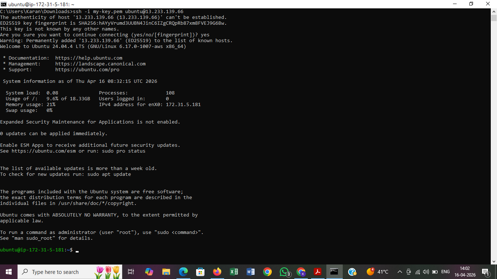
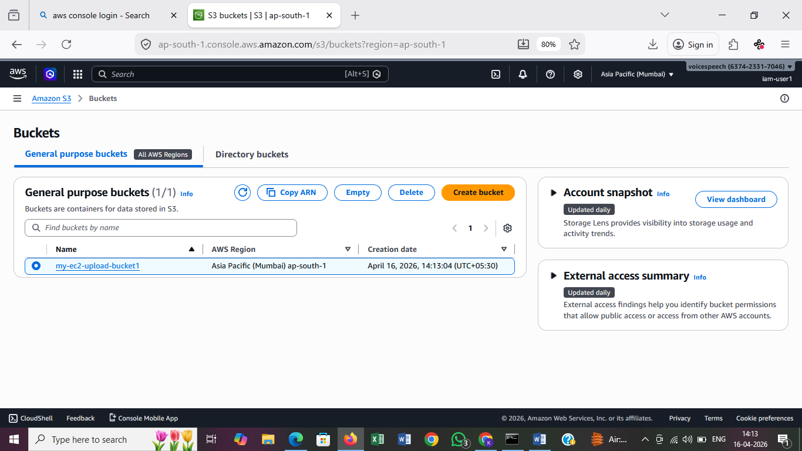
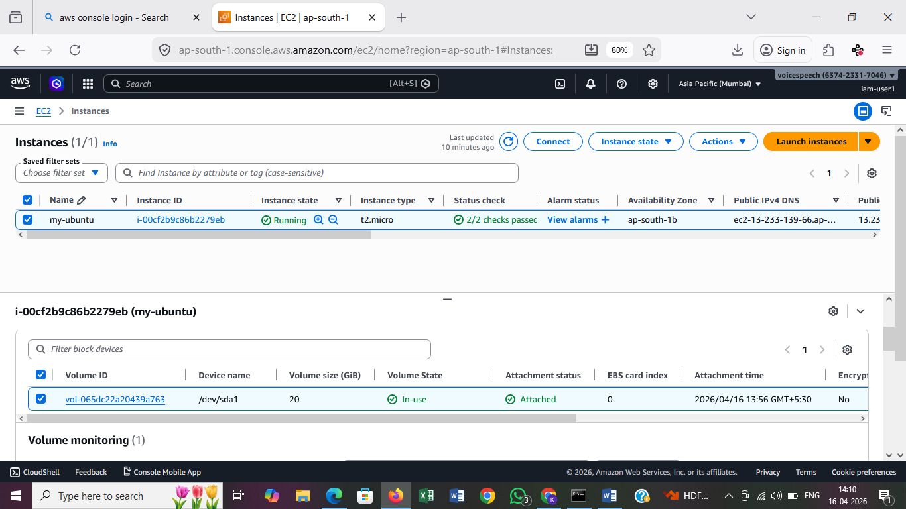
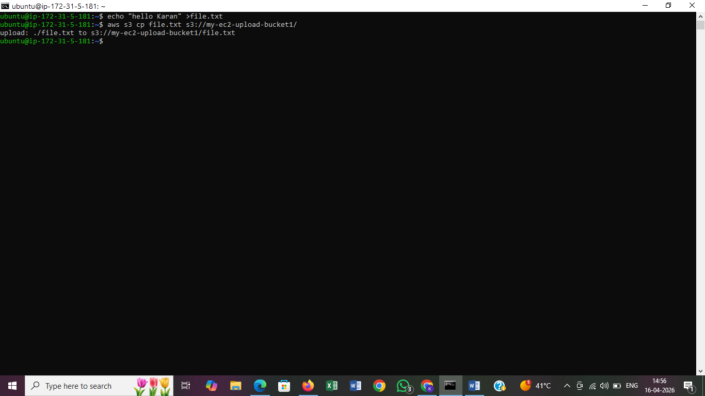
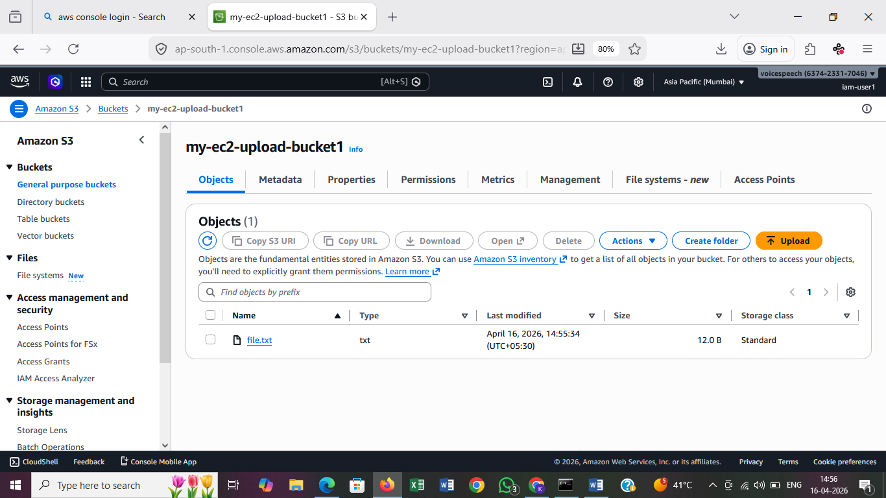
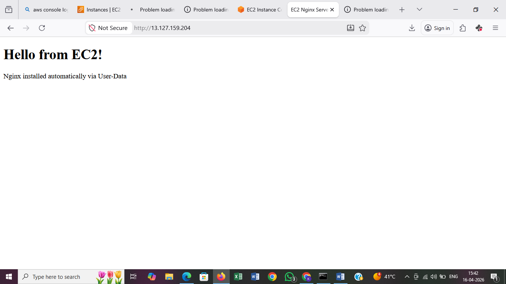

# 🚀 AWS EC2 Hands-on Tasks

---

# 📌 Task 1: Simple EC2 Instance

## Steps:

1. Launch EC2 instance
2. Select Ubuntu AMI
3. Choose instance type (t2.micro)
4. Create/download key pair
5. Enable Public IP
6. Allow SSH (port 22) in Security Group
7. Set root volume to 20GB
8. Launch instance

## Connect to EC2:

```bash
chmod 400 my-key.pem
ssh -i my-key.pem ubuntu@<public-ip>
```

---




# 📌 Task 2: EC2, S3 & IAM Role

## Steps:

1. Create S3 bucket
2. Create IAM Role:

   * Trusted entity: EC2
   * Attach policy: AmazonS3FullAccess
3. Attach IAM role to EC2 instance
4. SSH into EC2
5. Install AWS CLI:


```bash
sudo apt update
sudo apt install awscli -y
```

## Upload file to S3:

```bash
echo "hello" > file.txt
aws s3 cp file.txt s3://<bucket-name>/
```

## Verify:

* Check files in S3 console



---

# 📌 Task 3: EC2 & User Data

## Task 3.1: Install Nginx using User Data

### User Data Script:

```bash
#!/bin/bash
apt update -y
apt install nginx -y
systemctl start nginx
systemctl enable nginx
```

### Access:

```
http://<public-ip>:80


```

---


## Task 3.2: Install Docker & Run Containers

### User Data Script:

```bash
#!/bin/bash
apt update -y
apt install docker.io -y
systemctl start docker
systemctl enable docker

docker run -d -p 80:80 nginx
docker run -d -p 8080:80 httpd
```

### Access:

* Nginx → http://<ip>:80
* Apache → http://<ip>:8080

---

## Debugging User Data Issues:

```bash
cat /var/log/cloud-init-output.log
```

Check:

* Security group (port 80 open)
* Nginx status

---

# 📌 Task 4: Access Private EC2 Instance

## Architecture:

```
Your Laptop → Bastion Host → Private EC2
```

## Steps:

1. Create VPC with public & private subnets
2. Attach Internet Gateway to VPC
3. Configure route table for public subnet
4. Launch Bastion Host (public subnet)
5. Launch Private EC2 (private subnet, no public IP)

## Security Groups:

* Bastion: Allow SSH from your IP
* Private EC2: Allow SSH from Bastion only

## Connect:

### Step 1: Connect to Bastion

```bash
ssh -i my-key.pem ubuntu@<bastion-public-ip>
```

### Step 2: Connect to Private EC2

```bash
ssh -i my-key.pem ubuntu@<private-ip>
```

---

# ⚠️ Cleanup (Avoid Charges)

1. Terminate EC2 instances
2. Delete S3 bucket (empty it first)
3. Delete unused EBS volumes
4. Remove IAM roles (if not needed)

---

# 🎯 Key Learnings

* IAM User vs Role
* EC2 instance setup
* S3 integration
* User Data automation
* Bastion Host architecture

---


---

# 👨‍💻 Author

Karan Rajesh Dwivedi
