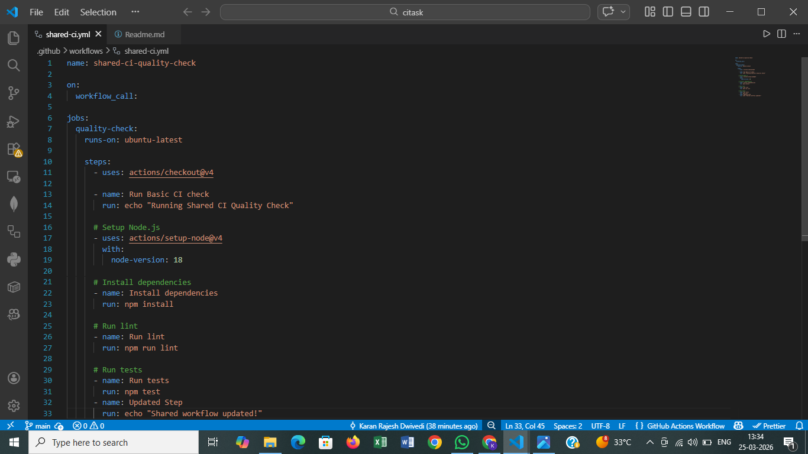
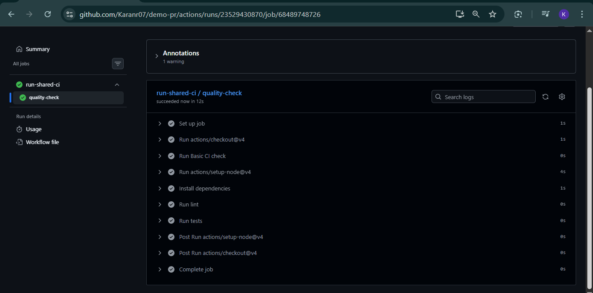

# GitHub Actions Reusable CI Workflow

## Overview

This assignment demonstrates how to create and use reusable GitHub Actions workflows to standardize Continuous Integration (CI) across multiple repositories.

Instead of duplicating workflow logic in every project, a central shared workflow is created and reused. This improves consistency, maintainability, and scalability.

## Task 1: Create Shared CI Quality Check Workflow

### Objective

Create a centralized workflow that can be reused by multiple repositories.

### Implementation

- Created repository: `PractiseCicd`
- Added workflow file: `.github/workflows/shared-ci.yml`
- Workflow includes:
  - Code checkout
  - Basic CI check
  - Node.js setup
  - Dependency installation
  - Lint check
  - Test execution


### Outcome

- Created a reusable CI workflow
- Eliminated duplication across repositories

## Task 2: Call Shared Workflow from Another Repository

### Objective

Reuse the shared workflow in a different repository.

### Implementation

- Created repository: `demo-pr`
- Added workflow: `.github/workflows/use-shared-ci.yml`

#### Workflow Code

```yaml
name: use-shared-ci

on:
  push:

jobs:
  run-shared-ci:
    uses: Karanr07/PractiseCicd/.github/workflows/shared-ci.yml@main
```

### Key Concept

- Used `workflow_call` to invoke shared workflow
- Avoided duplication of CI logic

### Outcome

- Shared workflow successfully executed in another repository
- Centralized CI pipeline achieved



## Task 3: Modify Shared Workflow and Observe Impact

### Objective

Verify that changes in the shared workflow automatically reflect in all consuming repositories.

### Implementation

Updated shared workflow:

```yaml
- name: Run Updated CI check
  run: echo "Shared workflow updated!"
```

Triggered workflow in the `demo-pr` repository.

### Observation

The updated message appeared in workflow logs:

```text
Shared workflow updated!
```

### Outcome

- Demonstrated real-time propagation of shared workflow changes
- Confirmed the effectiveness of reusable workflows


## Key Learnings

- Reusable workflows reduce duplication
- `workflow_call` enables cross-repository workflow usage
- Centralized CI improves consistency
- Changes made in one place reflect across all consumers