# Library Management System - Dockerized Application

## Project Overview
This project demonstrates containerization of a Flask-based Library Management System using Docker. It includes Docker fundamentals, container networking, Docker Compose orchestration, and a production-style flow with Nginx and MySQL.

## Tech Stack
- Flask (Python)
- MySQL
- Docker and Docker Compose
- Nginx (Reverse Proxy)

## Project Structure
```text
library-management-system/
|-- app.py
|-- Dockerfile
|-- docker-compose.yml
|-- .env
|-- .dockerignore
|-- routes/
|-- Controllers/
|-- Models/
`-- templates/
```

## Docker Setup
1. Build Docker image
```bash
docker build -t flask-app .
```

2. Run container
```bash
docker run -d -p 5000:5000 --name flask-container flask-app
```

## Docker Hub
1. Tag image
```bash
docker tag flask-app karanrajes04/flask-app:v1
```

2. Push image
```bash
docker push karanrajes04/flask-app:v1
```

## Docker Networking
1. Create network
```bash
docker network create my-network
```

2. Connect containers
```bash
docker network connect my-network flask-container
docker network connect my-network mysql
```

## Docker Compose Setup
Run the full stack:
```bash
docker compose up -d
```

Application flow:
```text
User -> Nginx -> Flask App -> MySQL
```

## Security and Resource Management
Run with CPU and memory limits:
```bash
docker run -d --memory="512m" --cpus="1.0" flask-app
```

Run container in read-only mode:
```bash
docker run -d --read-only flask-app
```

## Screenshots
The screenshots below are embedded directly from the local `screenshots` folder so they can be viewed from this README.

### Git Clone
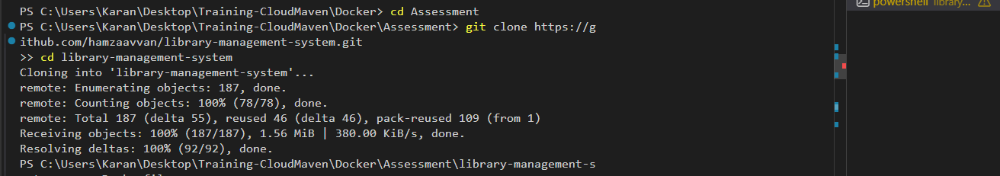

### Dockerfile
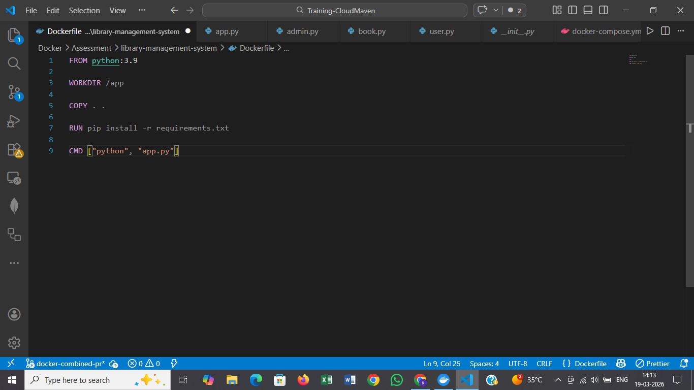

### Build Output
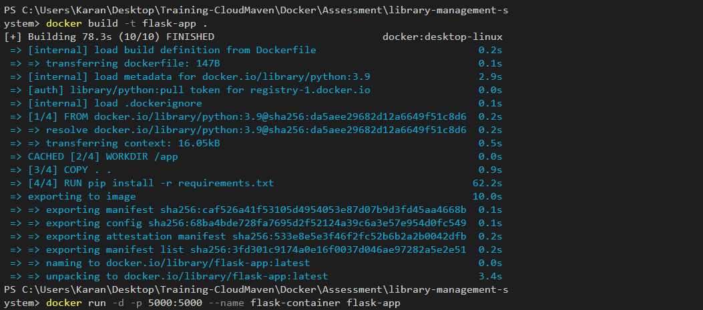

### Environment File
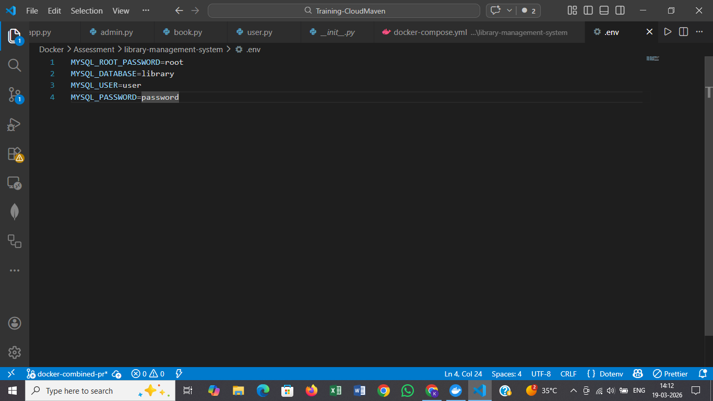

### Nginx Running
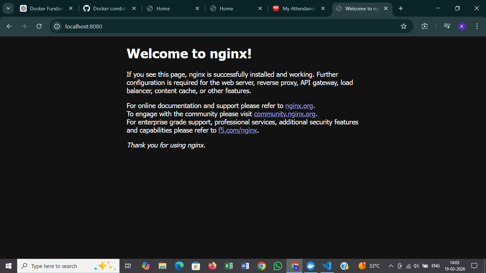

### Docker Compose
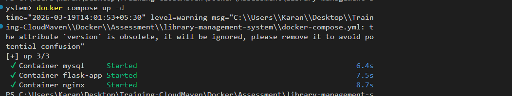

### Docker Compose (Step 1)


### Docker Compose (Step 2)
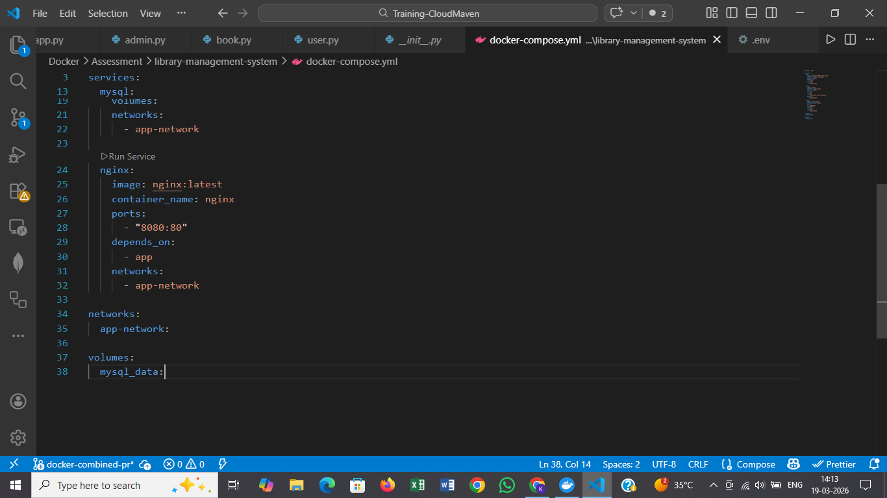

### Application Running
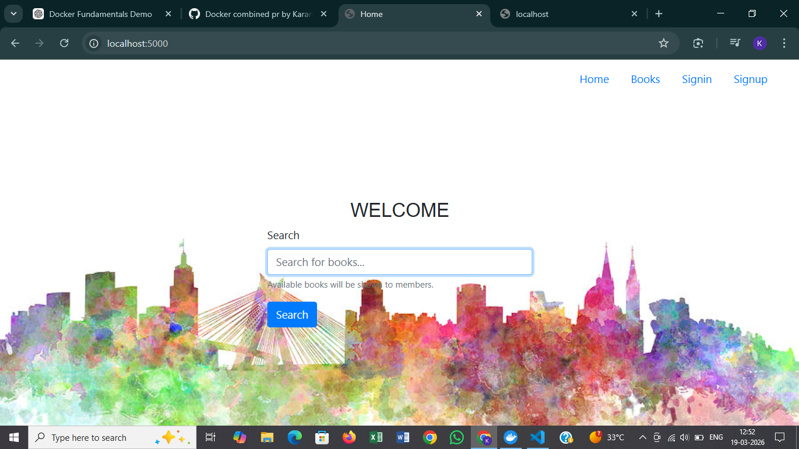

### Docker Logs
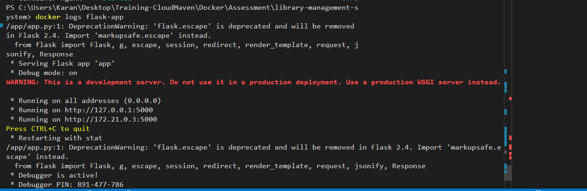

### Docker Network Creation and Connection
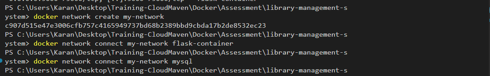

### Docker Login and Push
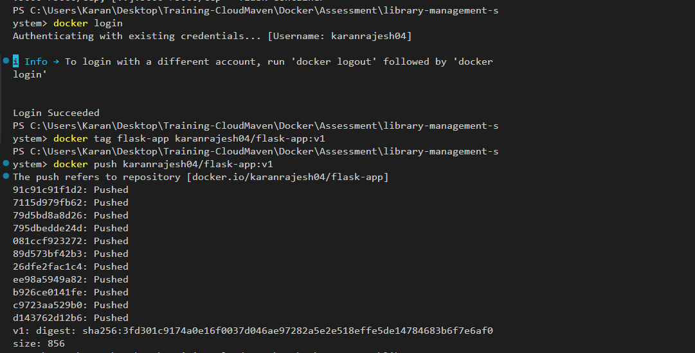

## Cleanup Commands
```bash
docker system prune -a
docker volume prune
docker network prune
```

## Key Concepts
- Image: Blueprint for containers
- Container: Running instance of an image
- Volume: Persistent storage for data
- Network: Communication between containers

## Conclusion
This project demonstrates practical Docker usage with:
- Multi-container setup
- Service networking
- Persistent storage using volumes
- Reverse proxy integration with Nginx
- Compose-based orchestration

## Author
Karan Rajesh Dwivedi