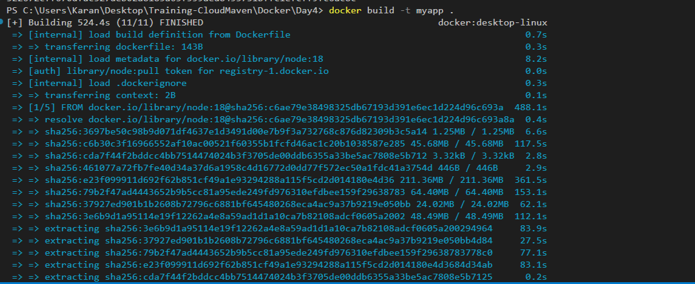
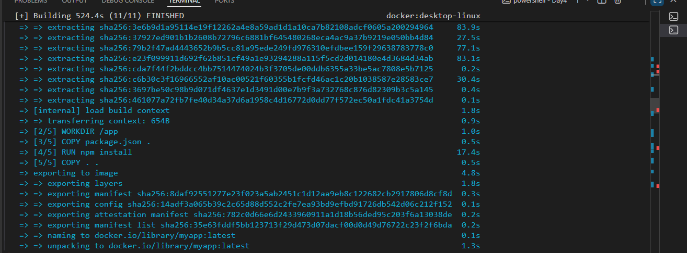
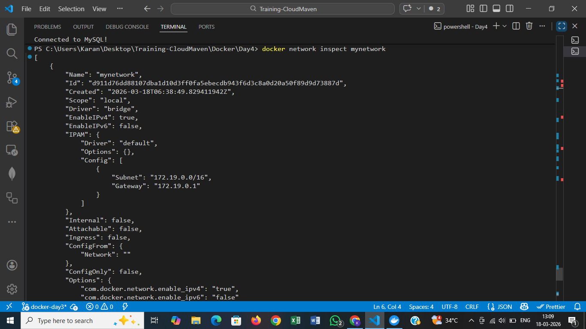
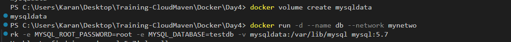
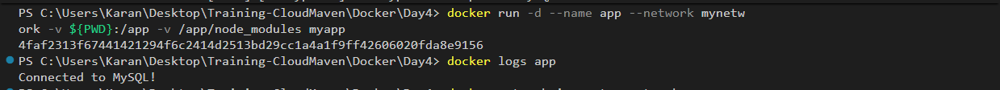
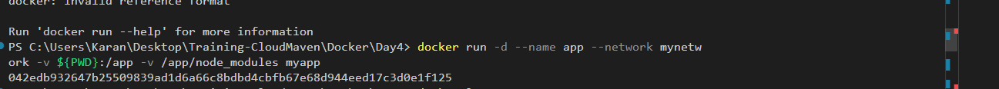
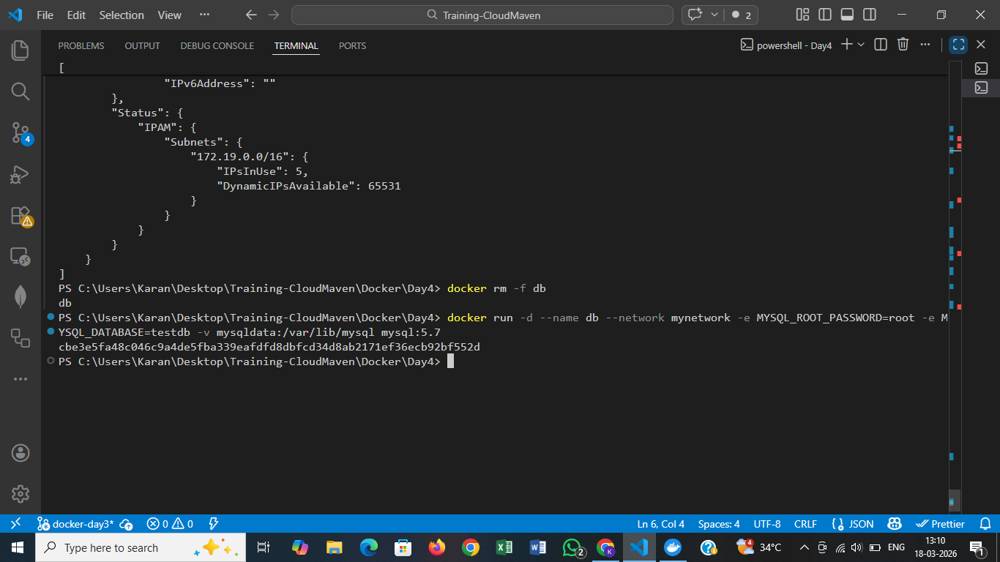

# Docker Day 4: Multi-Container Application with Networking and Persistence

## Objective

Build a multi-container application using Docker by:

- Running a Node.js application container
- Running a MySQL database container
- Connecting both containers over a custom Docker network
- Persisting MySQL data with a named Docker volume

## Project Structure

```text
Cloud-Maven-Training-Session/
└── Docker/
    └── Day4/
        ├── Dockerfile
        ├── app.js
        ├── package.json
        ├── README.md
        └── screenshots/
            ├── dockerbuild.png
            ├── dockerbuild1.png
            ├── Dockerfile.png
            ├── docker-run-app.png
            ├── newtwork-inspect.png
            ├── test-persistent.png
            ├── run-mysql.png
            └── dockervolme.png
```

## Step 1: Build Docker Image

Build the Node.js application image:

```bash
docker build -t myapp .
```




## Step 2: Create Custom Network

Create a custom network so containers can communicate with each other:

```bash
docker network create mynetwork
```



## Step 3: Create Named Volume

Create a named volume to persist MySQL data:

```bash
docker volume create mysqldata
```



## Step 4: Run MySQL Container

Start MySQL with required environment variables and volume mapping:

```bash
docker run -d \
  --name db \
  --network mynetwork \
  -e MYSQL_ROOT_PASSWORD=root \
  -e MYSQL_DATABASE=testdb \
  -v mysqldata:/var/lib/mysql \
  mysql:5.7
```



## Step 5: Run Application Container

Start the Node.js application container on the same network:

```bash
docker run -d \
  --name app \
  --network mynetwork \
  -v ${PWD}:/app \
  -v /app/node_modules \
  myapp
```



## Step 6: Container Communication

The application connects to MySQL using the database container name:

```js
host: 'db'
```

Because both containers are attached to `mynetwork`, Docker DNS resolves `db` automatically.

## Step 7: Verify Application Logs

Check logs to confirm the application is running correctly:

```bash
docker logs app
```

## Step 8: Inspect Docker Network

Inspect the network to verify connected containers and IP addresses:

```bash
docker network inspect mynetwork
```


## Step 9: Test Data Persistence

Remove and recreate the MySQL container to verify persistent storage.

Remove existing MySQL container:

```bash
docker rm -f db
```

Recreate MySQL container with the same volume:

```bash
docker run -d \
  --name db \
  --network mynetwork \
  -e MYSQL_ROOT_PASSWORD=root \
  -e MYSQL_DATABASE=testdb \
  -v mysqldata:/var/lib/mysql \
  mysql:5.7
```



## Conclusion

This task demonstrates a practical multi-container setup in Docker.

- The app and database containers communicate through a custom network
- MySQL data remains intact through container recreation using a named volume

These are core Docker concepts used in real-world deployments: container networking, persistent storage, and multi-container architecture.