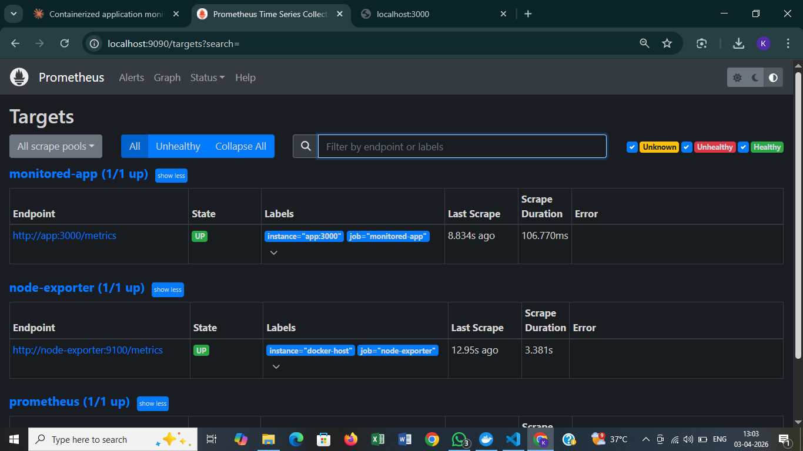
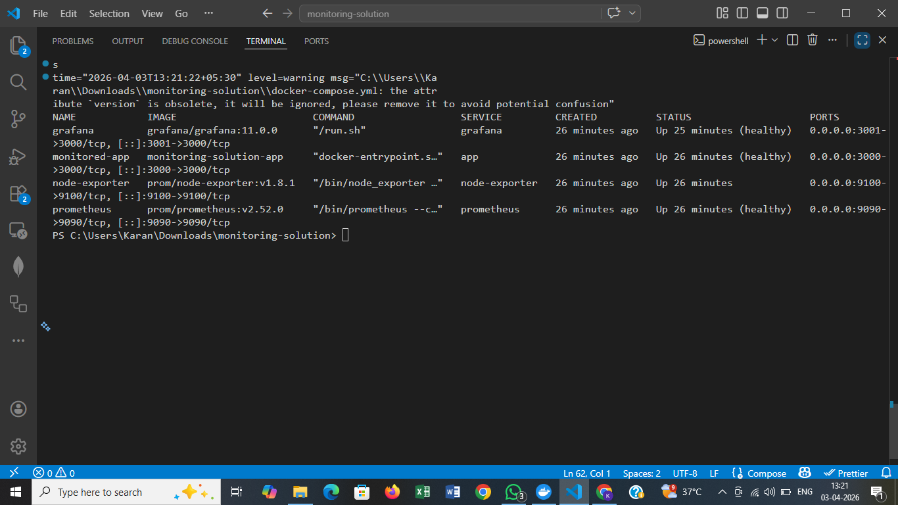
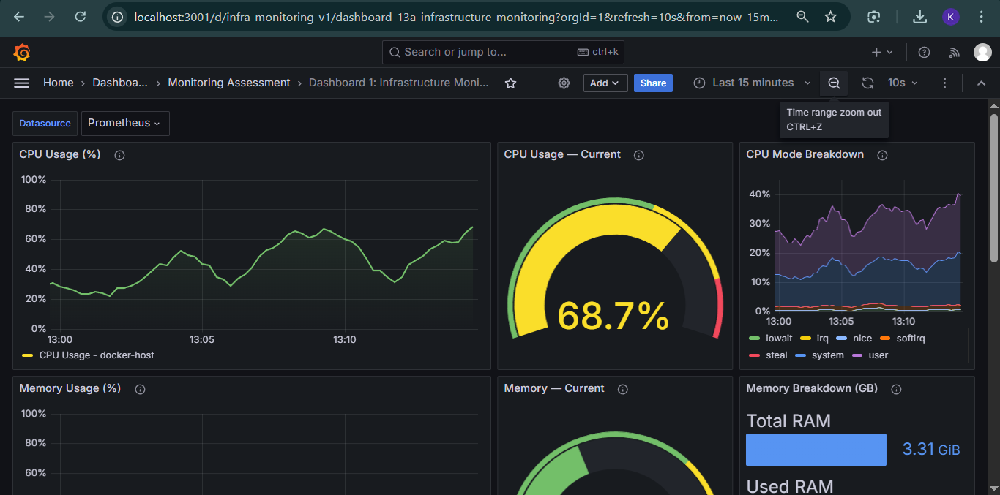
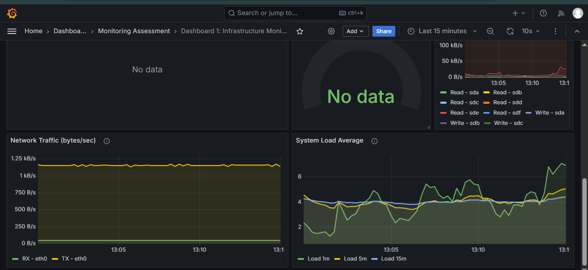
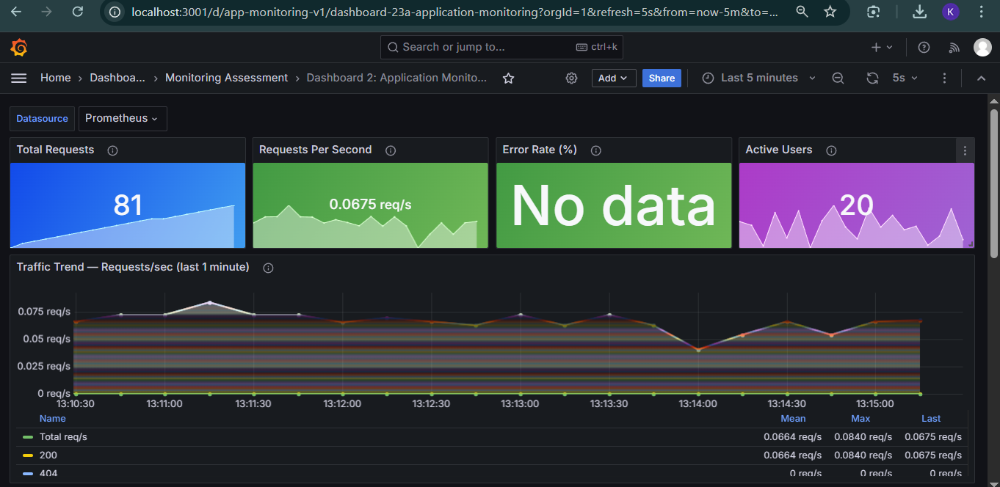
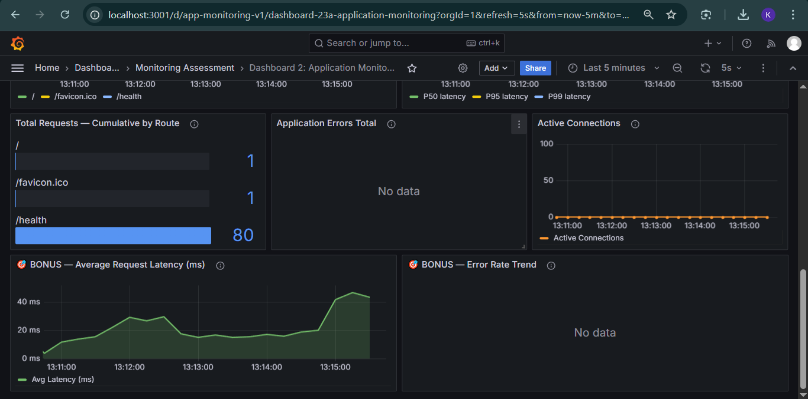

# 📊 Monitoring Implementation Assessment

---

## ✅ Task 1: Environment Setup

### 📌 Scenario

✔ Create a structured project directory
✔ Define all required configuration files
✔ Ensure services are properly networked

### 🛠️ Solution

```
Assessment/
├── docker-compose.yml
├── simulate-traffic.sh
├── .gitignore
│
├── app/
│   ├── app.js
│   ├── package.json
│   └── Dockerfile
│
├── prometheus/
│   └── prometheus.yml
│
└── grafana/
    ├── provisioning/
    │   ├── datasources/
    │   │   └── prometheus.yml
    │   └── dashboards/
    │       └── dashboards.yml
    └── dashboards/
        ├── infrastructure-monitoring.json
        └── application-monitoring.json
```

All services share a dedicated Docker bridge network:

```yaml
networks:
  monitoring:
    name: monitoring-network
    driver: bridge
```

---

## ✅ Task 2: Application Deployment

### 📌 Scenario

✔ Deploy a containerised application
✔ Expose metrics at `/metrics`
✔ Validate metrics accessibility

### 🛠️ Solution

Node.js Express app with `prom-client` exposing custom metrics:

```js
// Counter — total HTTP requests
const httpRequestsTotal = new client.Counter({
  name: 'http_requests_total',
  help: 'Total number of HTTP requests',
  labelNames: ['method', 'route', 'status_code'],
});

// Histogram — request duration
const httpRequestDurationSeconds = new client.Histogram({
  name: 'http_request_duration_seconds',
  help: 'HTTP request duration in seconds',
  labelNames: ['method', 'route', 'status_code'],
  buckets: [0.005, 0.01, 0.025, 0.05, 0.1, 0.25, 0.5, 1, 2.5, 5],
});

// Expose /metrics endpoint
app.get('/metrics', async (req, res) => {
  res.set('Content-Type', register.contentType);
  res.end(await register.metrics());
});
```

**Validate metrics accessibility:**

```bash
curl http://localhost:3000/metrics | grep http_requests_total
```


---

## ✅ Task 3: Prometheus Integration

### 📌 Scenario

✔ Configure Prometheus to scrape application metrics
✔ Configure Prometheus to scrape infrastructure metrics
✔ Validate all targets are UP

### 🛠️ Solution

```yaml
# prometheus/prometheus.yml

global:
  scrape_interval: 15s
  evaluation_interval: 15s

scrape_configs:

  - job_name: 'prometheus'
    static_configs:
      - targets: ['localhost:9090']

  - job_name: 'monitored-app'
    static_configs:
      - targets: ['app:3000']
    metrics_path: '/metrics'
    scrape_interval: 10s

  - job_name: 'node-exporter'
    static_configs:
      - targets: ['node-exporter:9100']
```

**Validate targets at:** `http://localhost:9090/targets`

All three jobs must show state: **UP** ✅



---

## ✅ Task 4: Monitoring Stack Execution

### 📌 Scenario

✔ Deploy all components using Docker Compose
✔ Ensure all services are accessible via browser

### 🛠️ Solution

```bash
docker compose up -d --build
docker compose ps
```

Expected output:

```
NAME             STATUS              PORTS
monitored-app    Up (healthy)        0.0.0.0:3000->3000/tcp
node-exporter    Up                  0.0.0.0:9100->9100/tcp
prometheus       Up (healthy)        0.0.0.0:9090->9090/tcp
grafana          Up (healthy)        0.0.0.0:3001->3000/tcp
```

| Service       | URL                           | Credentials      |
|---------------|-------------------------------|------------------|
| Application   | http://localhost:3000         | —                |
| App Metrics   | http://localhost:3000/metrics | —                |
| Node Exporter | http://localhost:9100/metrics | —                |
| Prometheus    | http://localhost:9090         | —                |
| Grafana       | http://localhost:3001         | admin / admin123 |



---

## ✅ Task 5: Grafana Configuration

### 📌 Scenario

✔ Add Prometheus as a data source
✔ Validate connectivity

### 🛠️ Solution

Prometheus is auto-provisioned on startup via:

```yaml
# grafana/provisioning/datasources/prometheus.yml

apiVersion: 1

datasources:
  - name: Prometheus
    type: prometheus
    access: proxy
    url: http://prometheus:9090
    isDefault: true
    editable: true
    jsonData:
      timeInterval: '15s'
      httpMethod: POST
```

**Validate at:** `http://localhost:3001/connections/datasources` → click **Test**


---

## ✅ Task 6: Dashboard Design

### 📌 Dashboard 1: Infrastructure Monitoring

✔ CPU Usage
✔ Memory Usage
✔ Disk Usage

### 🛠️ Solution — Key Panels & Queries

**CPU Usage (%)**

```promql
100 - (avg by (instance) (rate(node_cpu_seconds_total{mode="idle"}[2m])) * 100)
```

**Memory Usage (%)**

```promql
((node_memory_MemTotal_bytes - node_memory_MemAvailable_bytes)
  / node_memory_MemTotal_bytes) * 100
```

**Disk Usage (%)**

```promql
100 - ((node_filesystem_avail_bytes{mountpoint="/",fstype!="tmpfs"}
  / node_filesystem_size_bytes{mountpoint="/",fstype!="tmpfs"}) * 100)
```





---

### 📌 Dashboard 2: Application Monitoring

✔ Total Requests
✔ Requests Per Second
✔ Traffic Trend (last 1 minute)

### 🛠️ Solution — Key Panels & Queries

**Total Requests (cumulative counter)**

```promql
sum(http_requests_total)
```

**Requests Per Second**

```promql
sum(rate(http_requests_total[1m]))
```

**Traffic Trend — last 1 minute (by status code)**

```promql
sum by (status_code) (rate(http_requests_total[1m]))
```

**Request Latency P50 / P95 / P99**

```promql
histogram_quantile(0.95,
  sum(rate(http_request_duration_seconds_bucket[2m])) by (le))
```





---

## ✅ Task 7: Traffic Simulation & Analysis

### 📌 Scenario

✔ Generate traffic to the application
✔ Observe dashboard changes
✔ Identify behaviour patterns

### 🛠️ Solution

```bash
# Default: 120 seconds, 5 concurrent workers
./simulate-traffic.sh

# Custom: 300 seconds, 10 workers
./simulate-traffic.sh 300 10
```

The script hits all endpoints with weighted distribution:

```bash
ENDPOINTS=(
  "/" "/" "/" "/"                       # 4x — homepage
  "/health" "/health"                   # 2x — health check
  "/api/data" "/api/data" "/api/data"   # 3x — data endpoint
  "/api/slow"                           # 1x — slow response (200–1000ms)
  "/api/error"                          # 1x — generates HTTP 500
)
```

**Observed patterns on dashboards:**

✔ **Traffic Trend** panel shows visible request rate spike
✔ **Requests/sec** stat updates in real time
✔ **Total Requests** counter increments continuously
✔ **Error Rate (%)** rises as `/api/error` is hit
✔ **P95 / P99 Latency** increases when `/api/slow` is called
✔ **Active Connections** gauge fluctuates with concurrency


---

## ✅ Task 8: Observability Analysis

### 📌 1. Difference Between Infrastructure and Application Metrics

Infrastructure metrics originate from the OS and hardware — CPU cycles, RAM pages, disk sectors, and network packets — emitted regardless of what application runs on top (Node Exporter exposes these via Linux `/proc` and `/sys`). Application metrics are behaviour signals generated by the application code itself: how many HTTP requests arrived, how long each took, and how many errors occurred. The key difference is ownership — infra metrics describe the *environment*, app metrics describe *service behaviour*. Both are required: a healthy host can run a broken application, and a healthy application can silently exhaust host resources.

### 📌 2. Why Counters Require rate() / increase() Functions

Prometheus counters are monotonically increasing — they only go up (or reset to 0 on restart). Graphing a raw counter gives a steadily climbing line with no actionable insight. `rate(counter[window])` computes the per-second average rate of change, turning "1,000,000 total requests" into "45 req/s right now". `increase(counter[window])` gives the absolute growth over a window ("how many requests in the last 5 minutes?"). Both functions also handle counter resets gracefully on pod restarts, preventing false spikes. Without these functions, alerting on raw counter values is meaningless — you would always be alerting on an ever-growing number.

### 📌 3. How Monitoring Helps in Troubleshooting

Monitoring creates a timeline of evidence. When an incident occurs, dashboards reveal *when* metrics deviated from baseline and *which* signal moved first — establishing cause vs. effect. For example, if error rate spikes at 14:32, you can check: did CPU or memory spike before that (infrastructure problem)? Did request rate suddenly surge (traffic overload)? Did P99 latency balloon before the errors appeared (slow dependency)? Without time-series data, you debug in the dark using only the current system state. Monitoring shortens mean-time-to-detect (MTTD) via alerts, and accelerates mean-time-to-resolve (MTTR) by narrowing the problem from "something is broken" to "the `/api/data` route has been returning 503 at 40 req/s for the past 3 minutes."

---

## 🎯 Bonus: Custom Metrics & Extra Panels

### 📌 Scenario

✔ Add a custom metric (error count)
✔ Create additional panels
✔ Apply proper visualisation and labelling

### 🛠️ Solution

**Custom metric — `app_errors_total`**

```js
const appErrorsTotal = new client.Counter({
  name: 'app_errors_total',
  help: 'Total number of application errors',
  labelNames: ['type'],
});

// Incremented on every /api/error hit
appErrorsTotal.inc({ type: 'simulated_error' });
```

**Bonus Panel 1 — Average Request Latency (ms)**

```promql
sum(rate(http_request_duration_seconds_sum[1m]))
  / sum(rate(http_request_duration_seconds_count[1m])) * 1000
```

Thresholds: 🟢 < 300ms → 🟡 300ms → 🔴 800ms

**Bonus Panel 2 — Error Rate Trend (%)**

```promql
(sum(rate(http_requests_total{status_code=~"5.."}[1m]))
  / sum(rate(http_requests_total[1m]))) * 100
```

Essential for SLO / SLA breach detection.


---

## 📐 Architecture Diagram

```
┌──────────────────────────────────────────────────────────┐
│                    monitoring-network                     │
│                                                           │
│  ┌─────────────┐   scrape    ┌──────────────────────┐    │
│  │ monitored-  │◄────────────│                      │    │
│  │    app      │ :3000/metrics│     Prometheus       │    │
│  │ (Node.js)   │             │      :9090            │    │
│  └─────────────┘             │                      │    │
│                              │                      │    │
│  ┌─────────────┐   scrape    │                      │    │
│  │   node-     │◄────────────│                      │    │
│  │  exporter   │ :9100/metrics└──────────────────────┘   │
│  │  (system)   │                        ▲                │
│  └─────────────┘                        │ query          │
│                                         │                │
│                              ┌──────────────────────┐    │
│                              │       Grafana         │    │
│                              │       :3001           │    │
│                              │  Dashboard 1 (infra)  │    │
│                              │  Dashboard 2 (app)    │    │
│                              └──────────────────────┘    │
└──────────────────────────────────────────────────────────┘
```

---

## 🔥 Final Notes

✔ `docker compose up -d --build` → starts all 4 services
✔ `app:3000/metrics` → application metrics endpoint
✔ `node-exporter:9100` → infrastructure metrics endpoint
✔ `rate()` → converts counters to per-second rates
✔ `histogram_quantile()` → computes P50 / P95 / P99 latency
✔ Grafana datasource + dashboards → auto-provisioned on startup

---

## 👨‍💻 Author

Karan
