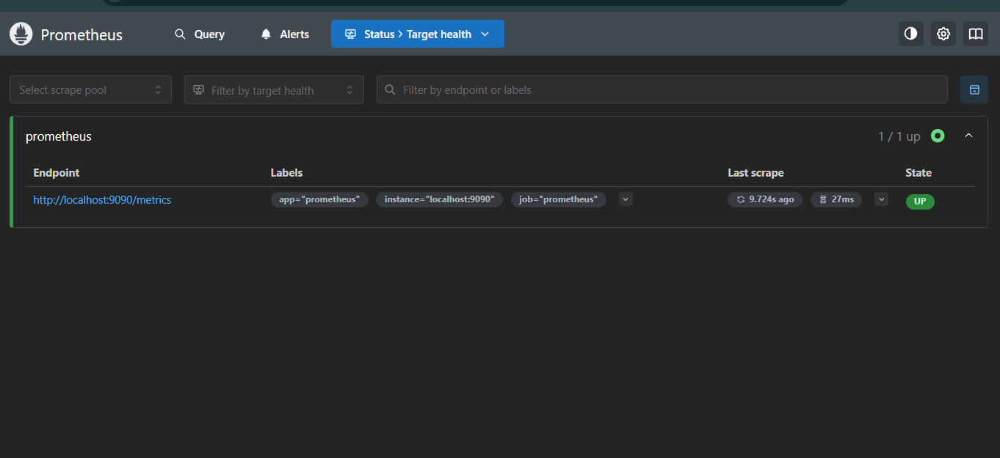
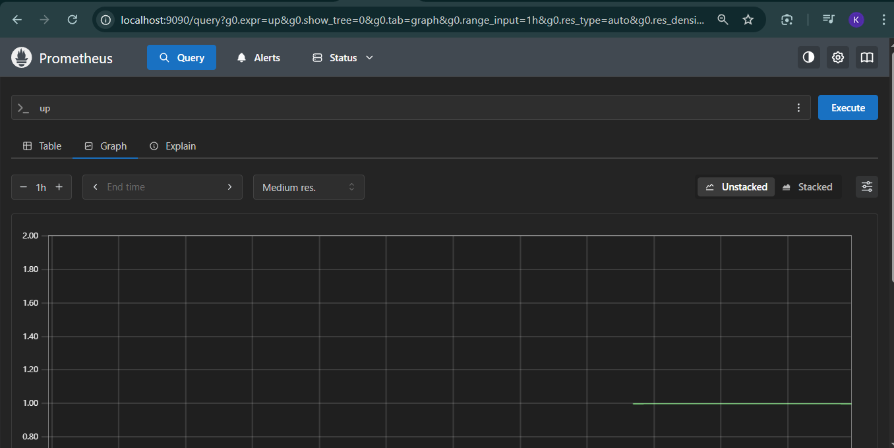

# Prometheus & Grafana Monitoring Setup

A simple monitoring stack using Docker Compose with Prometheus and Grafana.

---

## Project Structure

```
Monitoring-Logging/Day2/
├── docker-compose.yml
└── prometheus.yml
```

---

## Files

### docker-compose.yml

```yaml
version: '3.8'

services:

  prometheus:
    image: prom/prometheus:latest
    container_name: prometheus
    ports:
      - "9090:9090"
    volumes:
      - ./prometheus.yml:/etc/prometheus/prometheus.yml

  node-exporter:
    image: prom/node-exporter:latest
    container_name: node-exporter
    ports:
      - "9100:9100"

  grafana:
    image: grafana/grafana:latest
    container_name: grafana
    ports:
      - "3000:3000"
    environment:
      - GF_SECURITY_ADMIN_PASSWORD=admin123
```

### prometheus.yml

```yaml
global:
  scrape_interval: 15s

scrape_configs:

  - job_name: 'prometheus'
    static_configs:
      - targets: ['localhost:9090']

  - job_name: 'node-exporter'
    static_configs:
      - targets: ['node-exporter:9100']
```

---

## Steps to Run

**Step 1** — Create project folder

```bash
mkdir Day2
cd Day2
```


**Step 2** — Start all containers

```bash
docker compose up -d
```

**Step 3** — Check all containers are running

```bash
docker compose ps
```

You should see 3 containers all with status `Up`:
- prometheus
- node-exporter
- grafana

---

## Access the UIs

| Tool | URL | Login |
|------|-----|-------|
| Prometheus | http://localhost:9090 | No login |
| Node Exporter | http://localhost:9100/metrics | No login |
| Grafana | http://localhost:3000 | admin / admin123 |

---

## Verify Targets in Prometheus

1. Open http://localhost:9090
2. Click **Status** → **Targets**
3. You should see both targets as **UP**

```
prometheus    → UP ✅
node-exporter → UP ✅
```

---

## Practice PromQL Queries

Go to http://localhost:9090 → click **Graph** tab → paste any query below:

```promql
# Check if targets are UP (1 = UP, 0 = DOWN)
up

# Available memory in MB
node_memory_MemAvailable_bytes / 1024 / 1024

# CPU usage percentage
100 - (avg(rate(node_cpu_seconds_total{mode="idle"}[5m])) * 100)

# Disk usage percentage
100 - ((node_filesystem_avail_bytes{mountpoint="/"} / node_filesystem_size_bytes{mountpoint="/"}) * 100)

# System load average
node_load1

# Running processes
node_procs_running
```

---

## Connect Grafana to Prometheus

1. Open http://localhost:3000
2. Login with `admin / admin123`
3. Go to **Connections** → **Data Sources**
4. Click **Add data source** → select **Prometheus**
5. Set URL to `http://prometheus:9090`
6. Click **Save & Test**

### Import a Dashboard

1. Go to **Dashboards** → **Import**
2. Enter ID: `1860`
3. Click **Load**
4. Select **Prometheus** as data source
5. Click **Import**

---

## Useful Commands

```bash
# Stop all containers
docker compose down

# Stop and delete all data
docker compose down -v

# View logs
docker compose logs -f prometheus

# Restart a container
docker compose restart prometheus
```

---

## Key Concepts

| Term | Meaning |
|------|---------|
| `image` | App to download from Docker Hub |
| `ports` | `your_machine:container` port mapping |
| `volumes` | Share a file from your machine into the container |
| `scrape_interval` | How often Prometheus collects metrics |
| `job_name` | Name for a group of targets |
| `targets` | Address Prometheus scrapes metrics from |
| Node Exporter | Agent that exposes CPU, RAM, Disk metrics |
| PromQL | Prometheus query language |
