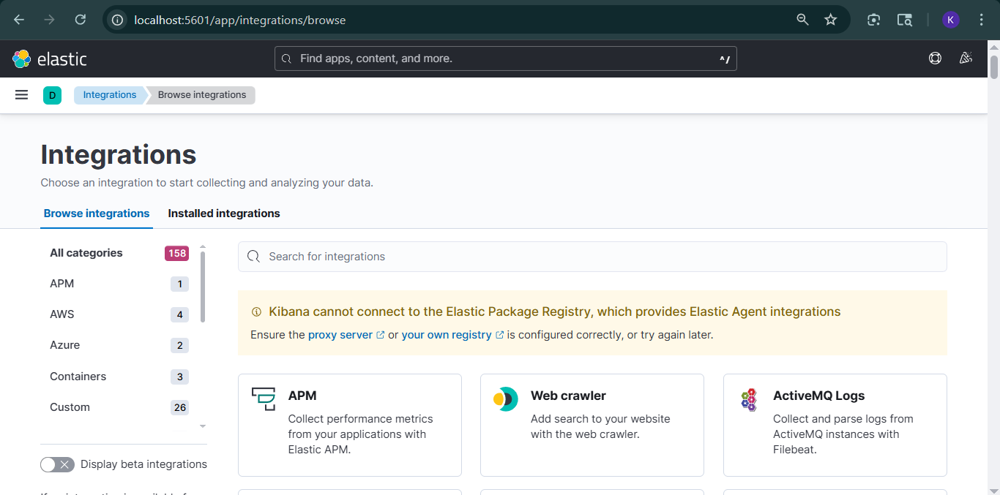
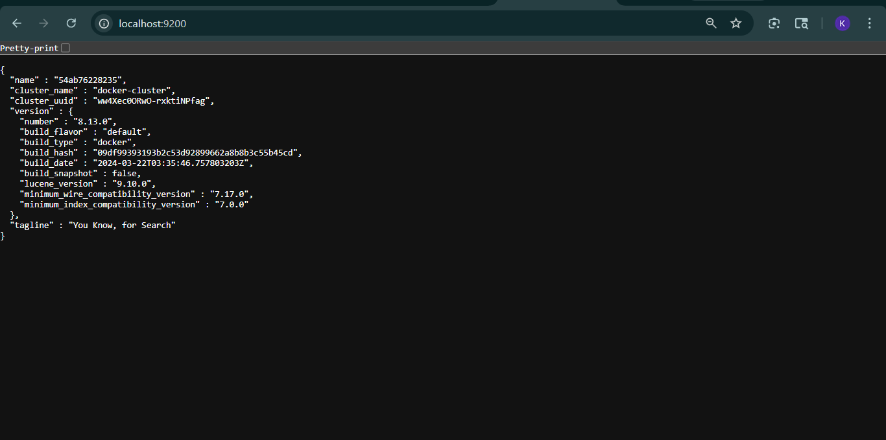

# ELK Stack Setup (Docker Compose)

## Project Overview

This project demonstrates how to set up a complete ELK Stack (Elasticsearch, Logstash, Kibana) using Docker Compose for centralized logging and monitoring.

The ELK stack helps in:

- Collecting logs
- Processing data
- Storing logs efficiently
- Visualizing data in real-time

## Tech Stack

- Docker
- Docker Compose
- Elasticsearch
- Logstash
- Kibana

## Project Structure

```text
.
├── docker-compose.yml
├── logstash/
│   └── pipeline/
│       └── logstash.conf
└── Readme.md
```

## Services

### Elasticsearch

- Stores and indexes logs
- Runs in single-node mode
- Exposes port `9200`

### Logstash

- Processes and transforms logs
- Reads input and sends data to Elasticsearch
- Exposes port `5044`

### Kibana

- Visualization dashboard
- Used to explore and analyze logs
- Exposes port `5601`

## Docker Compose Configuration

The `docker-compose.yml` file defines all three services:

- **Elasticsearch**
  - Uses the official image
  - Configured with:
    - `discovery.type=single-node`
    - Security disabled for local setup
  - Uses a named volume for persistence
- **Logstash**
  - Uses a pipeline config file mounted from `./logstash/pipeline/logstash.conf`
  - Depends on Elasticsearch
- **Kibana**
  - Connects to Elasticsearch
  - Depends on Elasticsearch

## Data Flow

```text
Input → Logstash → Elasticsearch → Kibana
```

- Logs are ingested through Logstash
- Processed data is stored in Elasticsearch
- Kibana provides visualization

## Logstash Configuration

`logstash/pipeline/logstash.conf`

Logstash reads pipeline configs from `/usr/share/logstash/pipeline` inside the container; this Compose setup mounts that path from `./logstash/pipeline/`.

```conf
input {
  stdin { }
}

output {
  elasticsearch {
    hosts => ["http://elasticsearch:9200"]
  }
  stdout { codec => rubydebug }
}
```

**Explanation**

- `stdin`: Takes input from terminal
- `elasticsearch`: Sends logs to Elasticsearch
- `stdout`: Displays logs in console (for debugging)

## How to Run

### Step 1: Start services

```bash
docker-compose up -d
```

### Step 2: Verify containers

```bash
docker ps
```

## Access Services


- Elasticsearch: http://localhost:9200
- Kibana: http://localhost:5601

## Testing the Setup

1. Attach to the Logstash container:

   ```bash
   docker attach logstash
   ```

2. Type any input (example):

   ```text
   Hello ELK Stack
   ```

3. Check output in:
   - Terminal (`stdout`)
   - Kibana (after indexing)

## Data Persistence

- Elasticsearch data is stored using a named volume (`esdata`).
- This ensures data is not lost when containers stop.

## Networking

Docker Compose automatically creates a network and services communicate using service names, for example:

- `http://elasticsearch:9200`


## Key Features

- Containerized ELK stack
- Easy setup using Docker Compose
- Persistent storage
- Service dependency management
- Centralized logging system

## Limitations

- Security is disabled (development only)
- Single-node Elasticsearch setup
- Not production-ready

## Future Improvements

- Add Filebeat for log collection
- Enable security (authentication)
- Scale Logstash instances
- Deploy on cloud (AWS)

## Conclusion

This project showcases how Docker Compose can be used to orchestrate multiple services and build a centralized logging system using the ELK stack. It demonstrates containerization, service dependencies, and real-time data visualization.

## Author

Karan Rajesh Dwivedi